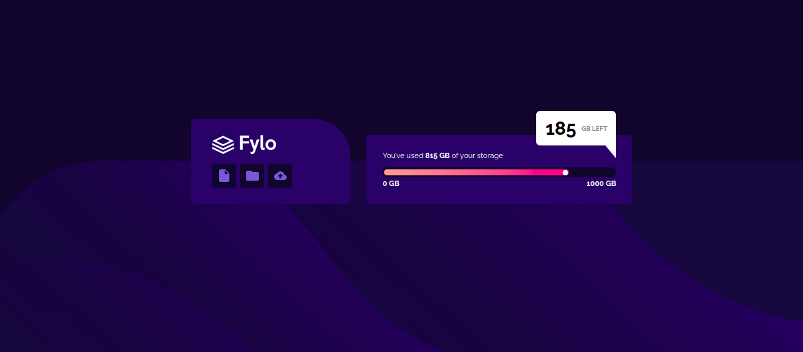

# Frontend Mentor - Fylo Data Storage Page Solution 

This is a solution to the [Fylo Data Storage Page Solution challenge on Frontend Mentor](https://www.frontendmentor.io/challenges/fylo-data-storage-component-1dZPRbV5n). Frontend Mentor challenges help you improve your coding skills by building realistic projects. 

## Overview

### The challenge

- Build out the project to the designs provided

### Screenshot

### Links

- Live Site URL: [github-pages](https://dehfachini.github.io/fylo-data-storage/)

## My process

### Built with

- Semantic HTML5 markup
- CSS custom properties

## Author

- Website - [Débora](https://github.com/dehfachini)
- Frontend Mentor - [@dehfachini](https://www.frontendmentor.io/profile/dehfachini)
